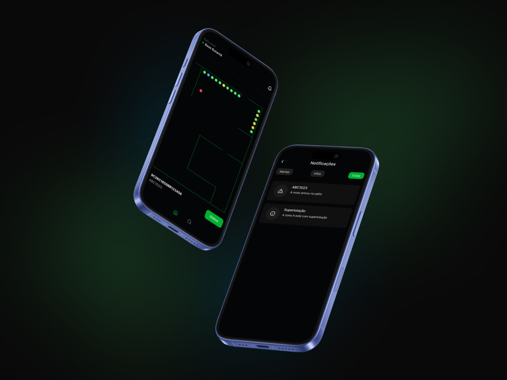

# 📱 Controle de Pátio - Mottu




## Sobre o Projeto
Este é um aplicativo mobile desenvolvido para auxiliar os funcionários da Mottu na **gestão e localização de motos dentro dos pátios de estacionamento**, garantindo **eficiência operacional e rastreabilidade** dos veículos, minimizando erros humanos, reduzindo o tempo de localização das motos e organizando melhor o espaço físico dos pátios.

**Link Figma:** https://www.figma.com/design/NUqU4fDAQuui4KsTPew7aa/Mottu?node-id=0-1&t=BPz6mwmRgUJmT9k8-1

## 🧱 Tecnologias Utilizadas

- **React Native** com Expo
- **AsyncStorage** para persistência local de dados


## 🚀 Instalando dependências

Para instalar as dependências do projeto siga estas etapas:

- Baixe o repositório
- Abra o terminal e digite o comando:

``` bash
npm install
```

## 🚀 Como rodar o projeto

### 1. Configuração da API (.NET)

1. Localize o arquivo `launchSettings.json` no projeto da API.
2. Pegue o **IPv4 da sua máquina** (no Windows, use `ipconfig` no terminal).
3. Substitua o trecho da configuração para incluir seu IPv4 no campo `applicationUrl`. Exemplo:

```json
"http": {
  "commandName": "Project",
  "dotnetRunMessages": true,
  "launchBrowser": true,
  "applicationUrl": "http://SEU_IPV4_AQUI:5241",
  "environmentVariables": {
    "ASPNETCORE_ENVIRONMENT": "Development"
  }
}
```

---

### 2. Configuração do App React Native

1. No projeto React Native, abra a pasta `config`.
2. Localize o arquivo de configuração (ex: `config.js`).
3. Substitua o `localhost` pelo mesmo **IPv4** definido no passo anterior.

Exemplo:

```js
// Antes
const BASE_URL = "http://localhost:5241/api";

// Depois
const BASE_URL = "http://SEU_IPV4_AQUI:5241/api";
```

---

### 3. Instalação das dependências

No terminal, dentro de cada projeto (API e React Native), instale as dependências:

```bash
# Na API (.NET)
dotnet restore

# No React Native
npm install
```

---

### 4. Rodando o projeto

* Para rodar a API:

```bash
dotnet run
```

* Para rodar o React Native:

```bash
npx expo start
```

---

✅ Agora sua API e o app React Native estarão conectados e rodando na mesma rede local.


> Caso possua o Android Studio instalado e configurado em sua máquina, basta digitar `a` no terminal para abrir um dispositivo Android.

> Caso não possua, instale o Expo Go em seu smartphone e escaneie o QR Code gerado no terminal que será exibido em seu smartphone (necessário que o PC e Smartphone estejam na mesma rede).

## 🤝 Colaboradores

Agradecemos às seguintes pessoas que contribuíram para este projeto:

<table>
  <tr>
    <td align="center">
      <a href="https://github.com/edvxndxvi">
        <br>
        <sub>
          <b>Edvan Davi - RM554733 - 2TDSPZ</b>
        </sub>
      </a>
    </td>
    <td align="center">
      <a href="https://github.com/rafaelromanini">
        <br>
        <sub>
          <b>Rafael Romanini - RM554637 - 2TDSPZ</b>
        </sub>
      </a>
    </td>
    <td align="center">
      <a href="https://github.com/ViniciusLABernardes">
        <br>
        <sub>
          <b>Vinicius Leandro - RM554728 - 2TDSPY</b>
        </sub>
      </a>
    </td>
  </tr>
</table>


